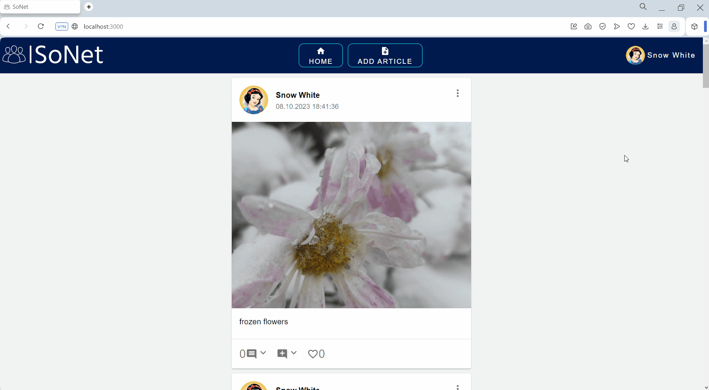

# SoNet

The SoNet a prototype of a social network web application. The backend of the application is built using the Express.js framework, while the frontend is built using React. The database used is PostgreSQL. The frontend, the backend and the database are deployed in Docker containers.

## Features
The application provides the following features:
  - User authentication and registration (including Google and Facebook authentication)
  - Posting, liking, and commenting on posts
  - Adding other users as friends
  - Searching for users in the system
  - Customizing own profile

## Technologies Used

 - JavaScript
 - Express.js
 - React.js
 - PostgreSQL
 - Docker 
 - Container Component Pattern

## React libraries

 - Axios
 - Material UI
 - React Query
 - Formik
 - PropTypes

## Prerequisites

Before running the application, make sure you have the following installed:
- Docker(including docker-compose)

## Setting Up Authentication Credentials

To use this project, you'll need to set up authentication credentials for both Google and Facebook APIs. These credentials are necessary to access their services securely. Here's how you can create the required credentials:

### Google Authentication Credentials

**Google Client ID and Client Secret**: In order to authenticate with Google services, you'll need to create a project on the [Google Cloud Console](https://console.cloud.google.com/) and obtain a Client ID and Client Secret. Follow these steps:

   - Go to the [Google Cloud Console](https://console.cloud.google.com/).
   - Create a new project or select an existing project.
   - Navigate to the "APIs & Services" > "Credentials" section.
   - Click on "Create Credentials" and select "OAuth client ID".
   - Choose "Web application" as the application type.
   - Enter the authorized redirect URIs and save the credentials.
   - You will receive a Client ID and Client Secret. 
   - Insert Client ID into `.env` as `GOOGLE_API_CLIENT_ID`.
   - Insert Client Secret into `api/.env` as `GOOGLE_API_CLIENT_SECRET`.

For detailed instructions, you can refer to the [Google Cloud documentation](https://cloud.google.com/docs/authentication/getting-started).

### Facebook Authentication Credentials

**Facebook App ID and App Secret**: To authenticate with Facebook services, you'll need to create a Facebook App on the [Facebook for Developers](https://developers.facebook.com/) platform. Here's how:

   - Go to the [Facebook for Developers](https://developers.facebook.com/) platform.
   - Create a new app and follow the setup process.
   - In the app dashboard, you'll find your App ID and App Secret under the "Settings" > "Basic" section.
   - Insert App ID into `.env` as `FACEBOOK_API_CLIENT_ID`. 
   - Insert App Secret into `api/.env` as `FACEBOOK_API_CLIENT_SECRET`.

Refer to the [Facebook for Developers documentation](https://developers.facebook.com/docs/apps/register) for more detailed guidance on creating a Facebook App.

## Installation

Clone this repository: `git clone https://github.com/marharita08/SoNet`.

To install the required libraries, simply execute the following files depending on your OS:
  - `install_api.cmd` or `install_api.sh`
  - `install_front.cmd` or `install_front.sh`

Before running the application, you need to set environment variables. Open and update `.env` in root folder. It should hold the following properties:

| Key                    | Value                                                |    
|------------------------|------------------------------------------------------|
| FRONT_HOST_PORT        | Front port on the host system                        |
| FRONT_CONTAINER_PORT   | Front port in the docker container                   |
| API_HOST_PORT          | API port on the host system                          |
| API_CONTAINER_PORT     | API port in the docker container                     |
| ADMINER_HOST_PORT      | Adminer port on the host system                      | 
| ADMINER_CONTAINER_PORT | Adminer port in the docker container                 |
| DB_HOST                | Database host                                        |
| DB_USER                | Name of database user                                |
| DB_PASSWORD            | Database password                                    |
| DB_DATABASE            | Database name                                        |
| DB_HOST_PORT           | Database port on the host system                     |
| DB_CONTAINER_PORT      | Database port in the docker container                |
| API_URL                | API url                                              |
| GOOGLE_API_CLIENT_ID   | Google client ID, required for login with Google     |
| FACEBOOK_API_CLIENT_ID | Facebook client ID, required for login with Facebook |

You also need to ensure that `api/.env` contains valid information. It should hold the following properties:

| Key                        | Value                                                    |    
|----------------------------|----------------------------------------------------------|
| APP_KEY                    | App key, random string                                   |
| GOOGLE_API_CLIENT_SECRET   | Google client secret, required for login with Google     |
| FACEBOOK_API_CLIENT_SECRET | Facebook client secret, required for login with Facebook |
| HASH_SALT                  | Salt for password hashing                                |
| SMTP_SERVICE               | Name of SMTP service                                     |
| SMTP_AUTH_USER             | SMTP username                                            |
| SMTP_AUTH_PASS             | SMTP password                                            |
| MAIL_FROM                  | Mail address to sent mails from                          |
| RESET_PASSWORD_URL         | Front URL to reset password                              |

Refresh `GOOGLE_API_CLIENT_ID`, `GOOGLE_API_CLIENT_SECRET`, `FACEBOOK_API_CLIENT_ID` and `FACEBOOK_API_CLIENT_SECRET` as it described in [previous section](#setting-up-authentication-credentials).
Update `APP_KEY` and `HASH_SALT`. If it's necessary, update other properties.

## Running the Application

To start the application, execute the `run_app.cmd` or `run_app.sh` or use command `docker-compose up`.

Open front URL (by default `localhost:3000`) in your browser.

To manage the database you can use the Adminer tool in your browser using the adminer URL (by default `localhost:8080`).
Then, connect to the database using the credentials specified in the .env file.

## Examples of usage

Login/Sign up

Article

Comments

Add article

Profile

Manage friends and friend requests

Search Users

Profile on smartphone

Articles on smartphone

